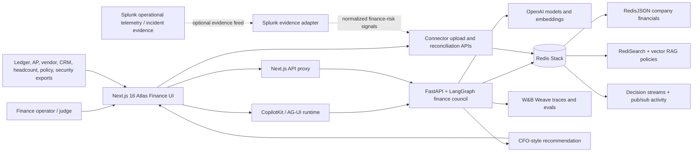

# Atlas Finance Architecture Diagram

Atlas is a live finance decision room with a Next.js operator surface, a
FastAPI/LangGraph agent service, Redis-backed operating memory, OpenAI-powered
finance roles, and W&B Weave observability/evaluation.

## Data Flow

1. The operator uploads company operating files or loads the live demo company.
2. Atlas parses and reconciles the files through connector APIs.
3. Redis Stack stores the system of record, search indexes, vector policy memory,
   decision streams, and live dashboard pub/sub state.
4. The LangGraph finance council retrieves grounded evidence from Redis, calls
   OpenAI for role-specific reasoning, debates the tradeoff, and produces a CFO
   recommendation.
5. W&B Weave traces each node, captures reliability scoring, and produces replay
   and promotion-gate artifacts for future prompt/model changes.
6. For the Splunk Agentic Ops track, Splunk telemetry or incident evidence can
   enter through the evidence adapter boundary and become finance-risk context
   for the same Atlas debate and audit pipeline.
